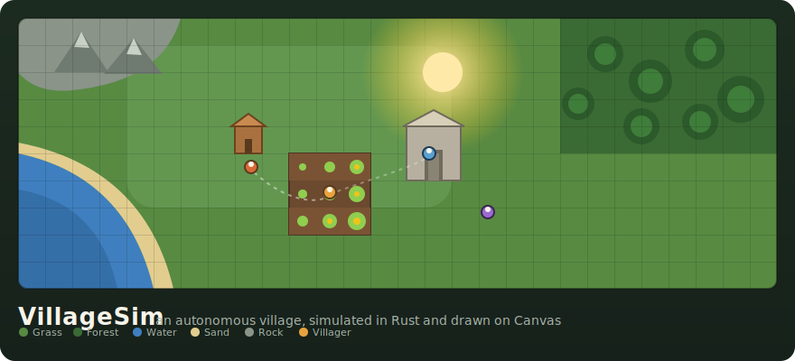
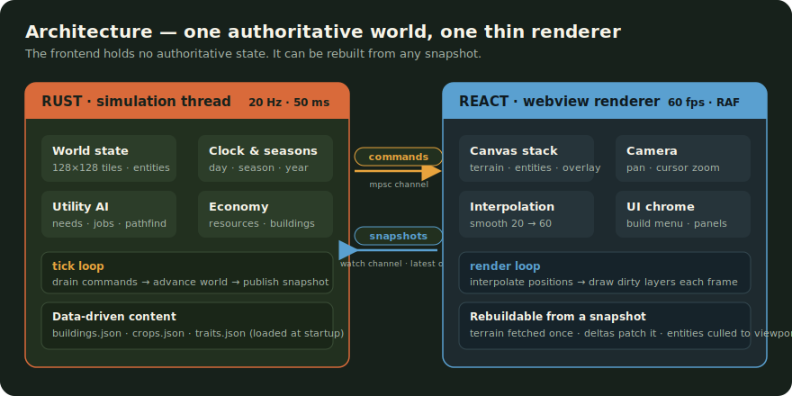
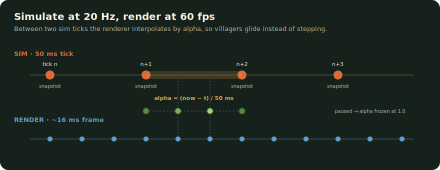
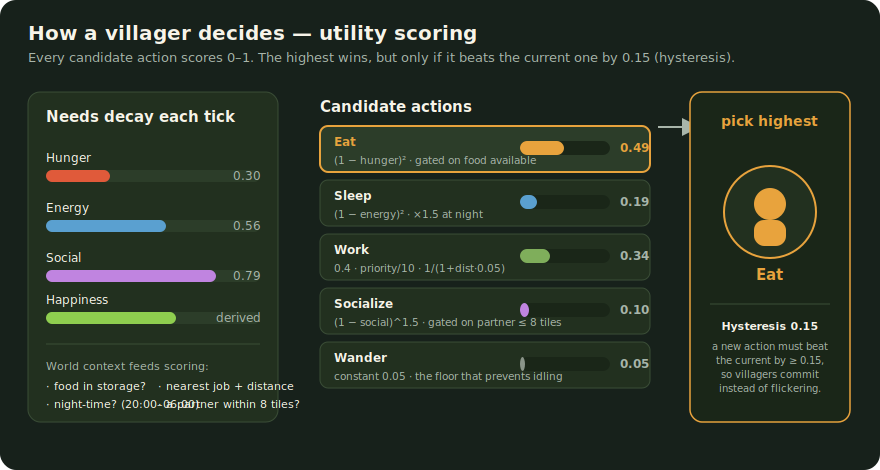
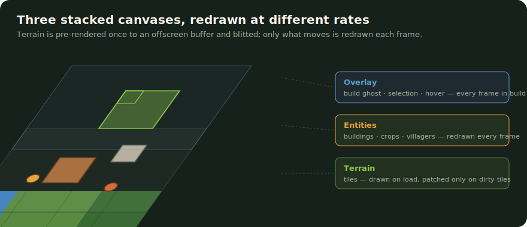

# VillageSim



**VillageSim** is a desktop village simulator where you shape the land and the villagers live their own lives. You don't command them directly — you place buildings, plant crops, and open jobs, then watch autonomous villagers decide for themselves when to work, eat, sleep, and socialize. Under the hood it's built like a proper game engine: an **authoritative Rust simulation** owns the world, and a **thin React + Canvas renderer** draws it, so the two can run at different rates and never disagree about what's real.

The result is a small world that keeps running whether you're watching or not: wheat ripens across the seasons, hunger creeps up until someone breaks from the fields to eat, and the whole thing stays smooth at 60fps because the renderer interpolates between simulation ticks.

> **Status:** built through **Milestone 7** (utility-driven AI with multiple villagers). Economy/production chains, population growth, weather, and save/load are specified but not yet implemented — see the [roadmap](#roadmap).

---

## What makes it tick

The defining design decision is the **split between simulation and rendering**. Rust holds the single source of truth — every tile, villager, need, and job. The webview holds *no authoritative state*; it can be rebuilt entirely from a single snapshot at any moment. They talk over two channels: intents flow **in** as commands, and the latest world state flows **out** as snapshots.



Keeping the world behind a command channel (rather than a shared `Arc<Mutex<World>>`) means the simulation thread owns the world exclusively and tick ordering stays **deterministic** — the same seed and the same commands always produce the same village.

### Smooth motion from a slow clock

The simulation only thinks 20 times a second (one tick every 50ms), but the screen refreshes at 60fps. If villagers only moved on ticks they'd visibly stutter. Instead the renderer keeps the **last two snapshots** and interpolates positions between them by an `alpha` factor — so a villager glides continuously even though the world underneath advances in discrete steps.



Speed controls (pause / 1× / 2× / 3×) scale the *interval* between ticks, never the content of a tick, so fast-forwarding a village produces exactly the same history as watching it in real time.

### Villagers that decide for themselves

Villagers aren't scripted. Each one carries **needs** — hunger, energy, and social — that decay every tick, plus a derived happiness. On each decision tick, every possible action is scored from 0 to 1 by a utility curve, and the villager picks the highest. A **hysteresis** margin stops them from flickering between two nearly-tied actions: a new action has to clearly win to interrupt the current one.



Because the scoring curves are non-linear (`Eat` ramps as `(1 − hunger)²`, `Sleep` gets a night-time multiplier, `Work` falls off with distance), villagers naturally batch their behaviour — grinding through work until hunger spikes, then breaking to eat, then drifting back. Nobody tells them to.

### Rendering in layers

The map is drawn across **three stacked canvases**, each redrawn only as often as it needs to be. Terrain is expensive, so it's pre-rendered once to an offscreen buffer and blitted with the camera transform; individual tile changes patch that buffer in place rather than triggering a full redraw.



Everything is **viewport-culled**: only entities within the camera bounds (plus a small margin) are sent in a snapshot or drawn, which keeps the payload small and the frame rate high even on a large map.

---

## Development

Prerequisites: Node 20.19+ and the current [Tauri 2](https://tauri.app) system dependencies for your platform.

```bash
npm install
npm run tauri dev
```

That launches the full desktop app with the Rust simulation connected.

### Browser-only demo

You can also run just the renderer in the browser against a deterministic in-memory world (island terrain + camera, no live simulation):

```bash
npm run dev
```

**Controls:** drag to pan · scroll wheel to zoom (anchored to the cursor) · `F` for fullscreen · `R` rotates a building in build mode · `Esc` exits build mode.

### Checks

```bash
npm test                                              # frontend unit tests (Vitest)
npm run build                                         # typecheck + Vite build
cargo test --manifest-path src-tauri/Cargo.toml --lib # Rust simulation tests
cargo check --manifest-path src-tauri/Cargo.toml      # Rust typecheck
```

---

## Project layout

```
src-tauri/            Rust — the authoritative simulation
  src/sim/            world, clock, agents, needs, jobs, pathfind, crops, buildings, utility
  src/snapshot.rs     sim state → compact render view
  src/commands.rs     Tauri IPC handlers
  data/               buildings.json · crops.json  (data-driven content)
src/                  React + Canvas — the renderer
  render/             Canvas stack, camera, per-layer draw code
  state/              snapshot handling, interpolation, IPC transport
  ui/                 BuildMenu, ClockBar, VillagerPanel
docs/
  villagesim-spec.md  full specification & milestone plan
  images/             the SVG illustrations used above
```

## Data-driven content

New buildings and crops are added by editing JSON — no gameplay code changes required. A building declares its footprint, cost, valid terrain, and the jobs it advertises; a crop declares its growth stages, viable seasons, and yield.

```jsonc
// src-tauri/data/buildings.json
{
  "id": "farm", "name": "Farm Plot",
  "footprint": [3, 3], "cost": { "wood": 10 },
  "build_ticks": 30, "valid_terrain": ["grass"],
  "jobs": [{ "kind": "tend_crops", "slots": 2 }]
}
```

## Roadmap

The full design lives in [`docs/villagesim-spec.md`](docs/villagesim-spec.md). Progress against its milestones:

| # | Milestone | Status |
|---|-----------|--------|
| M1 | Threading + IPC + interpolation pipeline | ✅ Done |
| M2 | Seeded terrain generation | ✅ Done |
| M3 | Building placement, ghost preview, demolish | ✅ Done |
| M4 | One villager, FSM, A* pathfinding | ✅ Done |
| M5 | Needs and a single job | ✅ Done |
| M6 | Clock, seasons, crops with growth stages | ✅ Done |
| M7 | Utility AI, multiple villagers, hysteresis | ✅ Done |
| M8 | Economy — resource nodes, production chains, hauling | 🔜 Planned |
| M9 | Population growth, births/deaths, traits, tech tree | 🔜 Planned |
| M10 | Persistence (save/load), weather, event log, polish | 🔜 Planned |
