# VillageSim — Project Technical Documentation

## 1. Executive Summary

[VillageSim](file:///d:/Code/Web%20Dev/Villiage-Sims/README.md) is a desktop village simulator built as a hybrid Rust and web application using [Tauri 2](file:///d:/Code/Web%20Dev/Villiage-Sims/src-tauri/Cargo.toml), [React 19](file:///d:/Code/Web%20Dev/Villiage-Sims/package.json), and an HTML5 Canvas rendering engine. In VillageSim, players do not command villagers directly; instead, villagers operate under autonomous utility AI with dynamic need decay (hunger, energy, social) while players place buildings, plant crops, and shape the settlement. The core architectural decision is a strict separation between an authoritative 20 Hz Rust simulation engine ([`src-tauri/src/sim/`](file:///d:/Code/Web%20Dev/Villiage-Sims/src-tauri/src/sim)) and a lightweight 60 FPS React + Canvas frontend ([`src/render/`](file:///d:/Code/Web%20Dev/Villiage-Sims/src/render)). This decoupling guarantees deterministic simulation logic and smooth motion interpolation without webview state synchronization conflicts.

---

## 2. Architecture Overview

VillageSim strictly isolates simulation state from view state. The Rust background thread owns the single source of truth (`World` struct), processing game rules, pathfinding, crop growth, and utility AI decisions at 20 ticks per second (50ms intervals). The React frontend owns no authoritative state; it receives viewport-culled state snapshots over a unidirectional channel and interpolates positions across frames.



### Key Architecture Boundaries

| Boundary | Mechanism | Description |
|---|---|---|
| **Simulation → Frontend** | `tokio::sync::watch` + Tauri `tick` Event | Pushes lightweight 20 Hz `TickSnapshot` payloads containing entity positions, clock state, and resource totals. |
| **Frontend → Simulation** | `std::sync::mpsc` + Tauri Invoke Commands | Transmits user intents (`SimCommand::PlaceBuilding`, `SimCommand::Demolish`, `SimCommand::SetSpeed`, etc.). |
| **Transport Fallback** | `Transport` interface ([`transport.ts`](file:///d:/Code/Web%20Dev/Villiage-Sims/src/state/transport.ts)) | Automatically switches between `TauriTransport` (for desktop build) and `BrowserTransport` (in-memory TypeScript simulation for browser/headless testing). |

---

## 3. Processing Pipeline

The simulation loop operates deterministically at 20 Hz. On every tick interval (or client command), the Rust thread executes a sequence of processing stages.



### Tick Processing Step-by-Step Flow

1. **Command Ingestion**: The thread drains queued `SimCommand` messages from the channel (e.g., building placement requests, speed changes, manual move orders).
2. **Environment & Clock Tick**: `Clock::tick` advances monotonic simulation ticks, updates seasons (Spring → Summer → Autumn → Winter), and triggers crop growth checks via `tick_crop`.
3. **Needs Decay & Utility Evaluation**: Villager needs (`hunger`, `energy`, `social`) decay exponentially. `score_all` computes utility curve scores for actions (`Eat`, `Sleep`, `Work`, `Socialize`, `Wander`). A hysteresis margin (`HYSTERESIS_MARGIN = 0.15`) prevents rapid action flickering.
4. **Pathfinding & Movement**: Villagers with active movement targets take discrete path steps using pre-calculated A* route nodes (`find_path`).
5. **Economy & Production**: Work cycles advance on active job sites (Farms, Granaries, Mills, Bakeries). Haulers transport items between inventories (`inventory_take` / `inventory_add`), and resource nodes are gathered.
6. **Progression & Housing Evaluation**: `satisfied_unlocks` evaluates tech tree prerequisites (`min_population`, `requires_building`). Housing capacity dictates automated villager births or starvation deaths when hunger reaches zero.
7. **Chronicle Logging**: World events (births, deaths, harvests, building completions, unlocks) append to the 200-entry ring buffer in `Chronicle`.
8. **Viewport Culling & Snapshot Serialization**: Entities outside the active camera viewport (plus `VIEWPORT_MARGIN_TILES = 4.0`) are filtered out. The final `TickSnapshot` is broadcast to subscribers.

---

## 4. Core Components

VillageSim's codebase is structured into backend engine modules and frontend rendering/UI modules.



### Backend Core Modules (`src-tauri/src/sim/`)

| Module | Primary Struct / Type | Responsibilities |
|---|---|---|
| [`world.rs`](file:///d:/Code/Web%20Dev/Villiage-Sims/src-tauri/src/sim/world.rs) | `World` | Aggregate root owning map grid (`128x128`), entities, resources, and main `tick()` function. |
| [`agents.rs`](file:///d:/Code/Web%20Dev/Villiage-Sims/src-tauri/src/sim/agents.rs) | `Villager`, `AgentState` | Represents villagers, movement speed, current pathing target, and active job reference. |
| [`utility.rs`](file:///d:/Code/Web%20Dev/Villiage-Sims/src-tauri/src/sim/utility.rs) | `ScoreContext`, `ActionKind` | Implements utility scoring equations, distance penalties, night multipliers, and hysteresis checks. |
| [`jobs.rs`](file:///d:/Code/Web%20Dev/Villiage-Sims/src-tauri/src/sim/jobs.rs) | `JobBoard`, `JobKind` | Advertises and reserves work slots (`TendCrops`, `Haul`, `Produce`, `Gather`). |
| [`economy.rs`](file:///d:/Code/Web%20Dev/Villiage-Sims/src-tauri/src/sim/economy.rs) | `ResourceTotals`, `CarryStack` | Manages resource stockpiles (Wood, Stone, Grain, Flour, Food, Gold) and hauling transfer rules. |
| [`catalog.rs`](file:///d:/Code/Web%20Dev/Villiage-Sims/src-tauri/src/sim/catalog.rs) | `Catalog`, `BuildingDef`, `CropDef` | Reads JSON metadata definitions for data-driven buildings and crops. |
| [`chronicle.rs`](file:///d:/Code/Web%20Dev/Villiage-Sims/src-tauri/src/sim/chronicle.rs) | `Chronicle`, `ChronicleBody` | Bounded event logger supporting versioned bincode persistence and JSON wire views. |
| [`persist.rs`](file:///d:/Code/Web%20Dev/Villiage-Sims/src-tauri/src/persist.rs) | `SaveFile` | Manages binary slot serialization (`SAVE_VERSION = 2`) using `bincode`. |

### Frontend Core Modules (`src/`)

| Component / Module | Path | Description |
|---|---|---|
| `Transport` | [`src/state/transport.ts`](file:///d:/Code/Web%20Dev/Villiage-Sims/src/state/transport.ts) | Unified async interface for IPC calls (`getTerrain`, `placeBuilding`, `saveGame`, etc.). |
| `Canvas` | [`src/render/Canvas.tsx`](file:///d:/Code/Web%20Dev/Villiage-Sims/src/render/Canvas.tsx) | Hosts 3 stacked HTML5 canvases (Terrain offscreen buffer, Entity frame render, Build ghost overlay). |
| `Camera` | [`src/render/camera.ts`](file:///d:/Code/Web%20Dev/Villiage-Sims/src/render/camera.ts) | Cursor-anchored pan/zoom matrix math and tile-to-screen coordinate transforms. |
| `BuildMenu` | [`src/ui/BuildMenu.tsx`](file:///d:/Code/Web%20Dev/Villiage-Sims/src/ui/BuildMenu.tsx) | Renders selectable building cards, cost requirements, tech locks, and demolish/save controls. |
| `VillagerPanel` | [`src/ui/VillagerPanel.tsx`](file:///d:/Code/Web%20Dev/Villiage-Sims/src/ui/VillagerPanel.tsx) | On-demand detail inspector displaying needs bars, state labels, active jobs, and character traits. |
| `ChronicleDrawer` | [`src/ui/ChronicleDrawer.tsx`](file:///d:/Code/Web%20Dev/Villiage-Sims/src/ui/ChronicleDrawer.tsx) | Collapsible log viewer with camera jump-to-event synchronization. |

---

## 5. API Contracts & Message Schemas

Communication between Tauri Rust handlers and the React client relies on strict TypeScript interfaces and Serde Rust structs.



### Key Wire Schemas (`src/state/types.ts` & `src-tauri/src/snapshot.rs`)

#### `TickSnapshot` Schema
```json
{
  "tick": 1240,
  "villagers": [
    { "id": 1, "x": 34.25, "y": 12.80, "state": 2 }
  ],
  "buildings": [
    { "id": 10, "kind": 1, "x": 30, "y": 10, "rot": 0, "state": 1, "progress": 100 }
  ],
  "crops": [
    { "id": 5, "kind": "wheat", "x": 31, "y": 11, "stage": 2, "watered": true }
  ],
  "resources": {
    "wood": 45, "stone": 20, "grain": 12, "flour": 5, "food": 30, "gold": 100
  },
  "housingCapacity": 7,
  "clock": { "day": 4, "season": "Summer", "year": 1, "speed": 1 },
  "chronicleSeq": 18,
  "unlocked": ["hut", "farm", "granary", "mill"]
}
```

#### `VillagerDetail` Schema (On-Demand Fetch)
```json
{
  "id": 1,
  "name": "Eldrin",
  "state": 2,
  "stateLabel": "Harvesting Wheat",
  "hunger": 0.85,
  "energy": 0.60,
  "social": 0.75,
  "happiness": 0.73,
  "jobKind": "tend_crops",
  "jobSite": 10,
  "traits": ["Hardworking", "EarlyBird"]
}
```

---

## 6. Infrastructure & Deployment

### Tech Stack Specifications

- **Desktop Framework**: Tauri 2.0 (`@tauri-apps/api` v2.0, `@tauri-apps/cli` v2.0)
- **Rust Toolchain**: Edition 2024 (Rust `>= 1.85`), `tokio` (async/sync watch channels), `bincode` v2, `noise` 0.9, `pathfinding` 4.0
- **Frontend Stack**: React 19, TypeScript 5.9, Vite 8.0, Vitest 4.0, TailwindCSS v4
- **Asset Generation**: Declarative pixel generator (`tools/genart/index.ts`) generating `public/art/tiles.png` and `public/art/atlas.json`

### Build & Test Commands

```bash
# Frontend Unit Tests (Vitest)
npm test

# Frontend TypeScript check + Vite bundle
npm run build

# Rust Engine Unit & Integration Tests
cargo test --manifest-path src-tauri/Cargo.toml --lib

# Run Full Desktop App in Dev Mode
npm run tauri dev

# Run Browser-Only Demo (Headless Cloud / Web Testing)
npm run dev
```

---

## 7. Extension Patterns

### How to Add a New Building

1. **Define Content in JSON**: Open [`src-tauri/data/buildings.json`](file:///d:/Code/Web%20Dev/Villiage-Sims/src-tauri/data/buildings.json) and append your building definition:
   ```json
   {
     "id": "blacksmith",
     "name": "Blacksmith",
     "footprint": [3, 3],
     "cost": { "wood": 20, "stone": 15 },
     "build_ticks": 40,
     "valid_terrain": ["grass"],
     "jobs": [{ "kind": "produce_tools", "slots": 1 }],
     "unlock": { "min_population": 8, "requires_building": "mill" }
   }
   ```
2. **Add Generator Art**: Edit [`tools/genart/recipes.ts`](file:///d:/Code/Web%20Dev/Villiage-Sims/tools/genart/recipes.ts) to define sprite palette layers.
3. **Re-generate Sprite Sheet**: Run `npm run art` to update `public/art/tiles.png` and `public/art/atlas.json`.

### How to Add a New Crop

1. Edit [`src-tauri/data/crops.json`](file:///d:/Code/Web%20Dev/Villiage-Sims/src-tauri/data/crops.json) specifying growth stages and viable seasons.
2. Update crop rendering logic in [`src/render/drawTerrain.ts`](file:///d:/Code/Web%20Dev/Villiage-Sims/src/render/drawTerrain.ts) or [`drawEntities.ts`](file:///d:/Code/Web%20Dev/Villiage-Sims/src/render/drawEntities.ts).

---

## 8. Rules & Anti-Patterns

### Development Principles (`AGENTS.md`)

- **Vite Target**: `vite.config.ts` must maintain `build.target: "es2020"` (do NOT revert to `safari13`, as esbuild in Vite 8 will fail destructuring).
- **Art Palette Constraint**: Art generator only permits the 29 curated color hexes defined in [`tools/genart/palette.ts`](file:///d:/Code/Web%20Dev/Villiage-Sims/tools/genart/palette.ts).
- **Chronicle Serialization Rule**: `ChronicleBody` in Rust persistence must maintain default externally-tagged serde representation (do NOT add `#[serde(tag = "...")]` to storage types, as `bincode` will fail).
- **No Direct Mutation**: Frontend components must never mutate or guess simulation state — all state transitions flow through `Transport` commands.

---

## 9. Dependencies

### Rust Dependencies (`src-tauri/Cargo.toml`)

| Package | Version | Purpose |
|---|---|---|
| `tauri` | 2.0 | Desktop window management and IPC bridge |
| `tokio` | 1.0 | Async task runtime and channels (`watch`, `oneshot`) |
| `bincode` | 2.0 | Versioned binary serialization for save slots |
| `serde` / `serde_json` | 1.0 | Data serialization and catalog parsing |
| `noise` | 0.9 | Simplex noise for seeded terrain generation |
| `pathfinding` | 4.0 | Grid pathfinding algorithms (A*) |

### NPM Dependencies (`package.json`)

| Package | Version | Purpose |
|---|---|---|
| `react` / `react-dom` | ^19.2.0 | UI panel component hierarchy |
| `@tauri-apps/api` | ^2.0.0 | Frontend IPC bindings |
| `vite` | ^8.0.10 | Frontend bundle & dev server |
| `vitest` | ^4.0.0 | Fast unit testing runner |
| `tsx` | ^4.23.1 | Executable TypeScript runtime for art generation |

---

## 10. Code Structure

```
VillageSim/
├── AGENTS.md                   # Repository guidance and strict build constraints
├── README.md                   # High-level overview and setup guide
├── docs/                       # Project documentation & diagrams
│   ├── diagrams/               # Architecture diagrams (draw.io & SVG)
│   ├── project-summary.md      # Source documentation file
│   └── project-summary.html    # Standalone HTML report
├── package.json                # Frontend & tooling dependencies
├── public/                     # Static web assets & committed sprite sheets
│   └── art/                    # Committed atlas.json and tiles.png
├── src/                        # React + Canvas Renderer
│   ├── render/                 # Canvas engine, camera math, and draw passes
│   │   ├── Canvas.tsx          # 3-layer stacked canvas React wrapper
│   │   ├── camera.ts           # Zoom/pan transformation matrix
│   │   ├── drawEntities.ts     # Villager and building entity render pass
│   │   └── drawTerrain.ts      # Offscreen terrain blit pass
│   ├── state/                  # State management & transport layer
│   │   ├── demoWorld.ts        # In-memory browser simulation engine
│   │   ├── snapshot.ts         # Interpolation buffer calculation
│   │   └── transport.ts        # Tauri IPC / Browser demo switch
│   └── ui/                     # Overlay React HUD components
│       ├── BuildMenu.tsx       # Construction palette & progression menu
│       ├── ChronicleDrawer.tsx # Collapsible event chronicle drawer
│       ├── ClockBar.tsx        # Speed controls and season clock indicator
│       ├── ResourceBar.tsx     # Stockpile totals & housing counter
│       └── VillagerPanel.tsx   # Villager inspector panel
├── src-tauri/                  # Authoritative Rust Simulation
│   ├── Cargo.toml              # Rust crate manifest
│   ├── data/                   # Data-driven JSON catalogs
│   │   ├── buildings.json      # Building specifications & costs
│   │   ├── crops.json          # Crop growth definitions
│   │   └── traits.json         # Villager personality traits
│   └── src/                    # Rust source code
│       ├── commands.rs         # Tauri IPC endpoint implementations
│       ├── lib.rs              # Tauri app builder and event loop setup
│       ├── persist.rs          # Save/load file binary persistence
│       ├── snapshot.rs         # Snapshot Rust DTO types
│       └── sim/                # Core simulation logic
│           ├── agents.rs       # Villager state and movement
│           ├── catalog.rs      # JSON catalog loader
│           ├── chronicle.rs    # Monotonic event logging
│           ├── clock.rs        # Sim clock and seasonal cycles
│           ├── economy.rs      # Resource stockpiles and hauling
│           ├── jobs.rs         # Job board and slot reservation
│           ├── pathfind.rs     # A* grid pathfinder
│           ├── utility.rs      # Utility AI scoring curves
│           └── world.rs        # Main simulation loop & tick dispatch
└── tools/                      # Development tooling
    └── genart/                 # Sprite art generator source code
```
