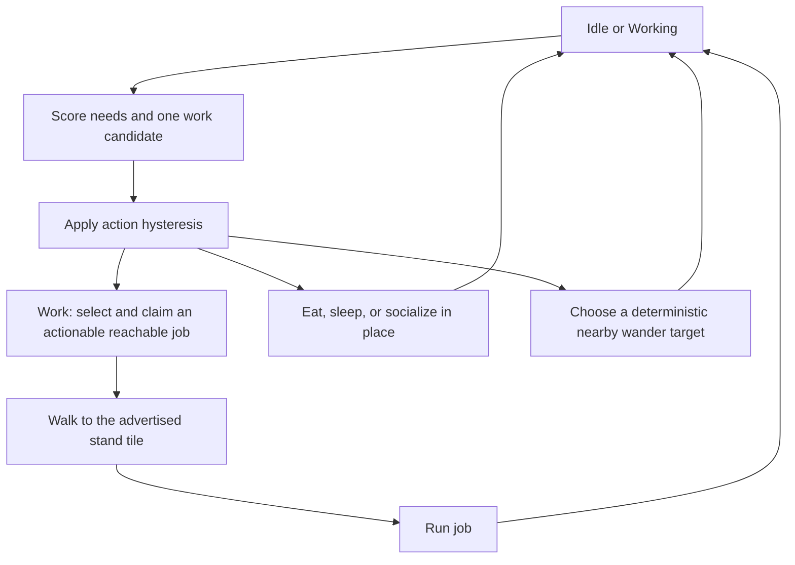

# Rust simulation and villager movement review

Date: 2026-09-02. Reviewed baseline: `b969f24` on `main`.

## Assessment

The apparent lack of a logical movement sequence has identifiable causes in the simulation. Villagers have a utility selector, a small activity state machine, and a tile path; they do not have a persistent plan connecting a need, a destination, and a sequence of tasks. Some wandering is intentional. Several other behaviors are defects or incomplete task scheduling.

Two critical defects were reproduced and fixed in this PR: starvation during travel despite available food, and an unreachable pickup blocking otherwise usable food-production logistics. The remaining findings below are deliberately deferred. This review does not establish that the game is bug-free.

Here, **Critical / P1** means an avoidable loss of villagers or a blockage of essential food logistics. **Recommended / P2** covers incorrect movement, resource loss under specific conditions, and reproducibility defects. **P3** covers incomplete behavior and observability. Effort estimates: S = localized change; M = coordinated state/logic work; L = broader architecture work.

## Verification and limits

| Check | Result |
|---|---|
| Existing Rust suite before edits | 115 passed |
| Rust suite including regression scenarios | 121 passed |
| Frontend suite including mirrored scenarios | 211 passed across 24 files |
| Rust compile check | Passed |
| Application TypeScript check | Passed |
| Full frontend build | Blocked by an unchanged app-icon test error; see below |
| Repeatability probe | Two identical default worlds advanced 25,000 ticks; serialized state matched at every 1,000-tick checkpoint |
| Targeted simulation probes | Travel/starvation, inaccessible hauling, idle-job scoring, pickup retargeting, delivery resumption, dynamic diagonal blocking, full-buffer harvest, actual autosave boundary |

The probes ran the repository's actual Rust simulation modules in a temporary local diagnostic executable. They used controlled terrain, inventory, and villager states to isolate behavior. The committed regressions are in [world_review_tests.rs](../src-tauri/src/sim/world_review_tests.rs) and [demoWorld.test.ts](../src/state/demoWorld.test.ts). Births were allowed in the Rust scenarios; survival assertions track the original villager ID, so replacement births cannot conceal deaths.

The full build fails at [tools/genart/app-icon.test.ts:21](../tools/genart/app-icon.test.ts#L21): `TS2554: Expected 0 arguments, but got 1`. The parameter is declared as `Uint8Array`, whose `toString()` does not take the Buffer encoding argument used there. That file, the build configuration, and dependency manifests are unchanged from the reviewed baseline. This unrelated build blocker was not changed. Fix the helper's byte-to-text conversion in a separate scoped change before treating the full build as green.

No live Tauri/window verification or visual browser session was performed. Renderer interpolation, IPC delivery, all save compatibility/security concerns, and broad Rust/browser parity remain outside this review. The 25,000-tick probe is a one-day repeatability check with no player commands, not a multi-season or high-population performance certification.

## Current execution model

Sources: [world.rs](../src-tauri/src/sim/world.rs), [agents.rs](../src-tauri/src/sim/agents.rs), [utility.rs](../src-tauri/src/sim/utility.rs), [jobs.rs](../src-tauri/src/sim/jobs.rs), [pathfind.rs](../src-tauri/src/sim/pathfind.rs).

Each `World::advance()` advances the clock, applies day/weather effects, completes construction, grows crops and resource nodes, refreshes gather jobs, decays everyone's needs, ticks villagers in vector order, then handles population, unlocks, and objectives. Earlier villagers can claim jobs or take resources before later villagers act. That is stable ordering, but not simultaneous or fair scheduling.

Ordinary decisions happen while Idle or Working. Eat, Sleep, and Socialize run their own timers; travel follows the existing path until arrival or a detected obstruction. The new emergency-food rule can interrupt any non-Eating activity at zero hunger when a ration is available.

There is no journey to a home, food store, or social partner for those need activities. Socializing checks whether anyone is within eight tiles, without choosing a mutually committed partner. Wandering uses a seed/tick/villager hash to pick a tile within six tiles; reproducible randomness is not a daily routine. These are current behavior limits, not evidence of an A* failure.

## Critical fixes included

### C1. Villagers could starve during travel while food was available — P1, S

**Where:** `World::tick_villager_at`, `check_population_dynamics`, and browser `tickVillagerAt` in [demoWorld.ts](../src/state/demoWorld.ts).

**Evidence:** A villager with hunger 0.001 started a 60-tile work trip while food was zero. Ten rations arrived on the next tick. At tick 401 the original villager was dead and all ten rations remained. MovingTo never called the decision function, but hunger and the 300-tick starvation timer continued advancing.

**Fix:** At zero hunger, an available ration interrupts the current activity, including travel or a player move order. The ration is consumed once; eating is allowed to finish even if it began just before the death deadline. Job ownership and carried goods remain intact. A canceled player destination is not automatically resumed.

**Verification:** The same scenario now leaves the original villager alive, hunger restored, the work claim retained, and nine rations remaining. A second regression covers a meal beginning at starvation tick 299 and checks cargo preservation. Existing no-food starvation behavior remains covered. The emergency interruption is mirrored in the browser demo; the demo still does not simulate deaths.

### C2. One unreachable pickup could block food logistics elsewhere — P1, M

**Where:** `World::find_haul_task`, `nearest_storage_for`, `job_actionable`, `tick_haul`, and their browser equivalents.

**Evidence:** A farm containing five grain was enclosed by impassable terrain. A granary, bakery, and ten stockpile flour were accessible outside it. After 1,500 ticks, the baseline had not consumed any flour and the bakery inventory was empty. The first worker repeatedly started empty-handed work trips. The global task selector always returned the farm pickup, without validating either travel leg; reaching a Haul job's advertised stand tile did not mean its actual pickup was reachable.

**Fix:** Select haul tasks relative to the worker's position. Validate worker-to-pickup and pickup-to-delivery routes; skip unreachable production sources, storage sources, and recipe destinations. Prefer reachable storage, with a reachable stockpile fallback. An inaccessible task no longer hides later usable tasks.

**Verification:** The end-to-end regression starts with no food and produces/delivers usable food despite the enclosed farm. Additional Rust cases cover an enclosed nearest store, an inaccessible recipe destination, and an inaccessible storage source. Browser regressions cover the matching behavior.

**Remaining limits:** This does not reserve inventory or pickup tasks, choose alternative entrances, or replan an already-carried shipment after a topology change. Checks use the existing A* budget. Additional path searches add cost, so larger settlements need profiling before considering cached reachability.

## Deferred findings

### R1. Haulers discard pickup intent and take unnecessary return trips — P2, M

**Where:** `World::tick_haul`, `begin_work`, `begin_move_to_job`; [economy.rs](../src-tauri/src/sim/economy.rs), `HaulTask` and `CarryStack`.

**Evidence:** A worker standing at a second farm's stocked pickup tile `(11,2)` was redirected to a newly stocked first farm at `(2,2)`, leaving the available goods behind. Before pickup, no task is stored on the villager; each Working tick asks for the globally first task again. Multiple haulers can chase the same goods, then turn around when another worker collects them.

A separate probe resumed a worker carrying grain to the stockpile after a needs break. The next destination was the claimed granary job tile `(15,9)`, rather than the delivery endpoint. `begin_work` always routes through the advertised job tile, even for an existing cargo trip.

**Impact:** This directly explains visible backtracking and apparently unrelated moves. It also wastes travel time as the economy changes during a trip.

**Follow-up:** Represent the active pickup/delivery phase explicitly; reserve or revalidate the chosen goods and destination; resume cargo delivery before visiting a job's generic stand tile. Define release behavior for interruptions, death, demolition, and saves. Do not solve this by merely increasing action hysteresis.

### R2. Unusable jobs still win utility selection — P2, M

**Where:** `utility::work_candidate`, `JobBoard::peek_best`, `World::maybe_decide` and `begin_work`.

**Evidence:** A farm was fully planted with watered, immature wheat and no seed grain. Its jobs still received a Work score. Over 200 ticks, the original full-needs villager remained Idle at the same position: Work won, `begin_work` found nothing actionable, cleared the current action, and the same process repeated. There is no fallback to the next feasible action in that decision.

**Impact:** Villagers can look stuck even though wandering or another need would be valid. Scoring can also favor a job different from the lower-ranked job that ultimately executes. Priority is sorted before Manhattan distance, rather than maximizing the actual distance-adjusted utility across feasible jobs.

**Follow-up:** Score a feasible work candidate once and execute that candidate, retaining deterministic tie breaks. If it becomes invalid, choose the next feasible action. Include idle farms, empty production buildings, and inaccessible work in coverage; cache expensive reachability only with explicit invalidation.

### R3. Newly blocked diagonal corners do not invalidate paths — P2, S

**Where:** `World::path_is_blocked_at`, `invalidate_paths_if_needed`, and `pathfind::successors`.

**Evidence:** Order `(0,0) → (1,1)`, then place a fence at `(1,0)` before the first movement tick. The existing diagonal remains and the villager moves from pixel `(16,16)` to about `(18.263,18.263)`. Initial A* forbids that corner cut, but path invalidation only checks target/waypoint tiles; neither is occupied by the new fence.

**Follow-up:** Revalidate each remaining edge, including both orthogonal flanks of diagonal edges and the current movement segment. Repath when an edge becomes illegal. Check the matching browser implementation too.

### R4. Work entrances and blocked standing workers are not maintained — P2, M

**Where:** `World::advertise_jobs_for`, `adjacent_stand_tiles`, `building_stand_tile`, `gather_stand_tile`, `place_building`, and `tick_working`.

**Evidence type:** Code trace. Building jobs keep the stand tiles selected at completion. Haul endpoints use the first currently passable perimeter tile, not necessarily one reachable by the worker. Placing a building triggers invalidation for MovingTo villagers only; a stationary worker can continue working after its stand tile is occupied. Gates are also impassable because every occupied tile is rejected; there is no gate-specific traversal rule.

**Impact:** A usable entrance can be overlooked, workers can remain inside new structures, and a village layout with gates can be less connected than it looks. C2 prevents one inaccessible task from blocking unrelated tasks, but does not correct these local access problems.

**Follow-up:** Define interaction entrances and pass-through building rules, choose reachable stand tiles, and revalidate work occupancy when buildings change. Specify whether gates should allow walking before changing their behavior.

### R5. Crop and production output can disappear at capacity — P2, S–M

**Where:** `World::tend_harvest_ready_crop`, `tick_produce`, and `production_free_capacity` in [economy.rs](../src-tauri/src/sim/economy.rs).

**Evidence:** A ready wheat crop beside a full 30-grain farm buffer was harvested in winter. The crop count fell from one to zero while the inventory stayed at 30: its entire three-grain yield disappeared. Winter prevented replanting from obscuring the result. The production completion path similarly truncates output to free capacity after consuming recipe inputs.

**Follow-up:** Wait for room before harvesting/committing production, or retain completed output until it can be deposited. Define a conservation rule and verify both completely full and partially full buffers. Treat this as a local capacity defect; the review did not establish a general economy-wide loss rate.

### R6. Daily autosaves contain a partially processed tick — P2, S

**Where:** `World::advance`, `on_day_rollover`, `maybe_autosave`, and `advance_clock`.

**Evidence:** Set the clock just before day rollover and execute one normal world tick with autosaving enabled. Both the live world and loaded save report tick 1, but the save has a full-needs Idle villager while the live world has decayed needs and a Wander path. Their serialized states differ. The autosave is written after advancing the clock/weather but before crops, villagers, population, and season-log processing finish.

**Impact:** Loading skips the remainder of that tick; tick-dependent choices can diverge afterward. A season transition entry can also be omitted. This is a consistency defect, not evidence of an unreadable or corrupted save file.

**Follow-up:** Save after the full tick is committed. Preserve explicit day-jump/autosave behavior in `advance_clock`. Compare a naturally triggered autosave against the completed live tick and continue both worlds, including season rollover and population events.

### R7. Released Haul claims can leave cargo without a delivery action — P2, M

**Where:** `World::try_repath`, `clear_released_work_claims`, `demolish`, `release_job_at`, and `tick_haul`.

**Evidence type:** Code trace. Some path-failure, storm, and demolition paths clear the work claim/state while leaving `carrying` populated. Only Haul work dispatches delivery. Reassignment to another job can therefore leave the cargo on a worker until Haul is selected again. Explicit player moves and deaths already return cargo to the stockpile, demonstrating that cleanup policies differ between exits.

**Follow-up:** Centralize job abandonment and cargo handling. Decide whether to complete, retarget, or return a shipment, then apply the same rule to every exit. Add a carrying-worker scenario with the advertised Haul building demolished or storm-damaged mid-trip.

### R8. Traits and daily-life sequences are incomplete — P3, M–L

**Where:** [traits.json](../src-tauri/data/traits.json), `World::tick_moving`, `tick_haul`, `begin_action`, `partner_in_range`, and `check_population_dynamics`.

**Evidence type:** Code trace. Fast Walker, Green Thumb, and Strong Back are assigned/displayed, but movement speed and carry capacity are fixed constants and work does not consult those traits. Sleeping and eating have no location targets. Socializing does not establish a partner or require proximity beyond the eight-tile range. Births add a full-needs villager every 200 ticks below housing capacity; there is no age, family, or food-surplus prerequisite. Death is starvation-only.

**Impact:** Labels and animations can suggest richer individual behavior than the simulation implements. Additional newborn workers also change job contention abruptly.

**Follow-up:** Choose the intended level of simulation first. Implement trait modifiers at their actual use sites, and add home/food/social destinations only if those journeys are desired. These are product/design decisions, not critical fixes for this PR.

## Determinism, weather, and testing observations

- Fixed per-tick deltas, stable vectors/BTree collections, deterministic wandering, and seed/date weather support repeatability. The runtime speed control changes tick spacing rather than movement per tick.
- The default-world repeatability probe matched at 25 checkpoints through 25,000 ticks. The existing 50-villager save test checks a round trip and one subsequent tick; it does not cover the autosave boundary defect above.
- Live commands are drained before a tick in [sim/mod.rs](../src-tauri/src/sim/mod.rs). Exact replay needs commands assigned to the same ticks, not merely the same command order at arbitrary wall-clock times. Cross-platform floating-point equivalence was not tested.
- Rain/storm water reset ordering and storm job removal have existing passing tests. Storm damage cancels recipe progress after ingredients were consumed; whether those ingredients should be lost is an unspecified damage policy. Storm-related cargo cleanup is R7.
- Job and path searches happen repeatedly, including retries against unusable jobs. C2 adds necessary route checks. High-population and heavily partitioned-map performance remains unmeasured; avoid promising 20 Hz under those conditions.
- Useful follow-up diagnostics would show the current action, job ID, actual pickup/delivery endpoint, current scores, and the reason for an interruption. The present thought bubble cannot explain task changes reliably.

## Suggested next session

1. Resolve the unrelated app-icon build error, then address R1 and R2 together: persistent haul intent, correct resumption, and feasible action selection. These most directly affect the reported movement sequence.
2. Address R3/R4/R7 together with topology-change scenarios: legal movement edges, usable entrances, and cargo/claim cleanup.
3. Address R5/R6 with conservation and completed-tick autosave checks, then extend replay coverage across seasons and representative player commands.
4. Decide which traits and home/food/social routines to implement. Add explanations of villager decisions before tuning utility curves blindly.

The PR changes only the two critical behaviors, their browser counterparts, regression coverage, and this review document. All deferred findings remain open.
